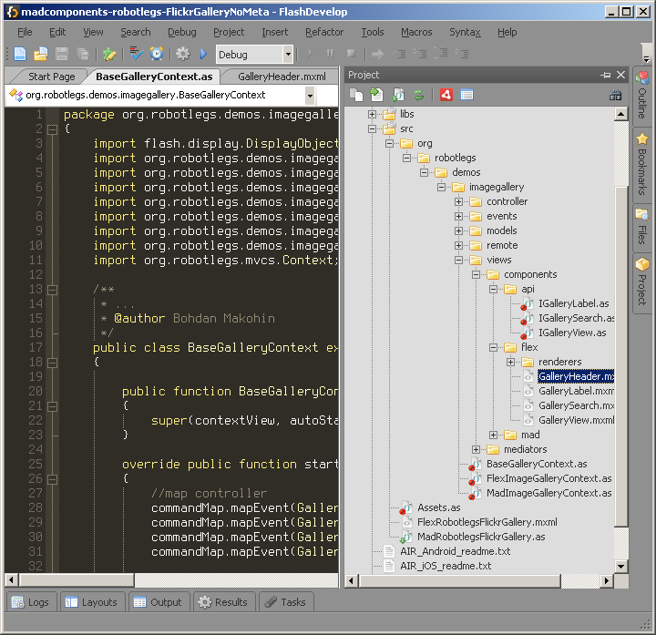

# Customizations for FlashDevelop 4.3+

## Contents
* Color theme (UI and syntax) "AssassinGray" (based on SinGray built-in theme). *Requires* "Terminus" font to be installed (available at http://terminus-font.sourceforge.net/).

## Installation

The customizations could be installed as ordinary FlashDevelop [extension](http://www.flashdevelop.org/wikidocs/index.php?title=Extensions), which is recommended. You may create extension by yourself (create zip archive of the `src` folder, name it 'AssassinGray.fdz' and double-click) or use one from `bin` folder.

However you are free to pick only specific settings from the repository and place them at "User config files.." of your FlashDevelop. It's not recommended a approach and may destroy your current settings without possibility to restore.